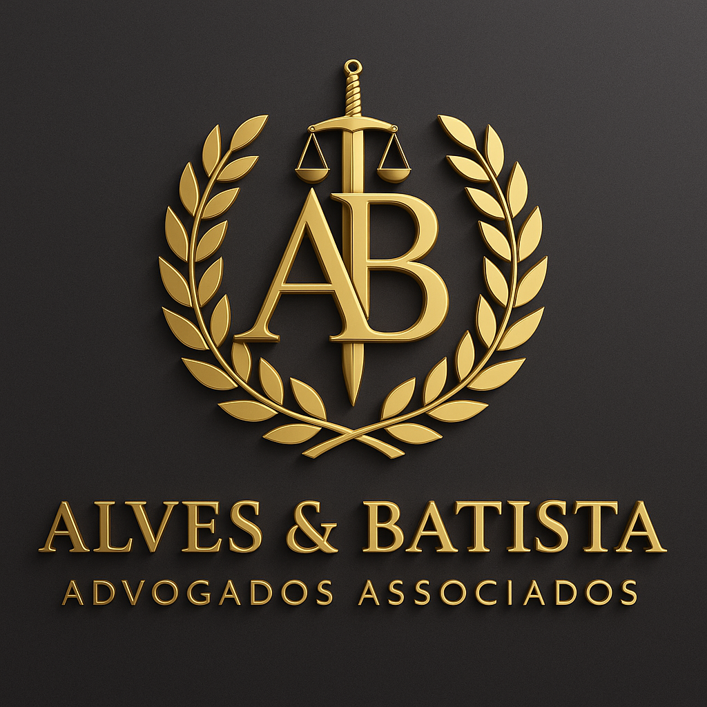

# ⚖️ Alves & Batista Advogados Associados

## Site Institucional Completo com IA de Atendimento

<div align="center">
  
</div>

---

## 🎯 Sobre o Projeto

Site institucional premium desenvolvido para **Alves & Batista Advogados Associados**, escritório de advocacia com mais de 20 anos de tradição e excelência jurídica. O projeto inclui design moderno, responsivo e uma assistente virtual inteligente (IA) para atendimento automatizado.

## ✨ Destaques do Projeto

### 🤖 **Sofia - Assistente Virtual IA**
- **Inteligência Artificial** integrada para atendimento 24/7
- Base de conhecimento sobre todas as áreas de atuação
- Respostas contextuais e personalizadas
- Integração direta com WhatsApp
- Sistema de sugestões rápidas
- Interface de chat moderna e intuitiva

### 🎨 **Design Premium**
- **Identidade Visual** baseada no logo oficial
- Paleta de cores **dourado (#d4af37)** e **preto (#1a1a1a)**
- Tipografia elegante: **Cormorant Garamond** + **Montserrat**
- Animações suaves e profissionais
- Preloader personalizado com logo
- Efeito de partículas no hero

### 📱 **Totalmente Responsivo**
- Design adaptável para todos os dispositivos
- Menu mobile otimizado
- Touch-friendly
- Performance em mobile otimizada

## 🚀 Tecnologias Utilizadas

```
HTML5          ████████████████████ 100%
CSS3           ████████████████████ 100%
JavaScript     ████████████████████ 100%
```

### Frameworks e Bibliotecas
- **Font Awesome 6.4** - Ícones vetoriais
- **Google Fonts** - Tipografia premium
- **AOS (Animate On Scroll)** - Animações ao rolar
- **IA Chat Bot** - Sistema próprio de chatbot

## 📁 Estrutura do Projeto

```
webapp/
├── index.html                    # Página principal
├── styles.css                    # Estilos customizados
├── script.js                     # JavaScript principal
├── assets/
│   └── js/
│       └── ai-chat.js           # Sistema de IA
├── images/
│   └── logo-alves-batista.png   # Logo oficial
├── README.md                     # Documentação geral
├── README-ALVES-BATISTA.md      # Este arquivo
├── PERSONALIZACAO.md            # Guia de personalização
└── INTEGRACOES.md               # Manual de integrações

```

## 🎯 Seções do Site

### 1. **Hero Section**
- Banner principal impactante
- Contadores animados de estatísticas
- Call-to-actions estratégicos
- Efeito de partículas animadas

### 2. **O Escritório**
- Apresentação institucional
- Destaques e diferenciais
- Certificações (OAB, ISO)
- Imagem profissional

### 3. **Áreas de Atuação** (6 especialidades)
- ⚖️ Direito Empresarial
- 🏠 Direito Imobiliário
- 💼 Direito Trabalhista
- 👨‍👩‍👧 Direito de Família
- 🛡️ Direito Penal
- 💰 Direito Tributário

### 4. **Nossa Equipe**
- Dr. Ricardo Alves - Sócio Fundador
- Dra. Juliana Batista - Sócia Fundadora
- Dr. Carlos Mendes - Direito Penal
- Dra. Fernanda Costa - Direito Trabalhista

### 5. **Casos de Sucesso**
- Slider interativo
- 3 casos documentados
- Resultados quantificados
- Navegação por categorias

### 6. **Depoimentos**
- Avaliações 5 estrelas
- Clientes reais
- Design em cards
- Fotos dos clientes

### 7. **Blog Jurídico**
- Artigos sobre LGPD
- Reforma Trabalhista
- Planejamento Sucessório
- Com autores e badges

### 8. **Formulário de Contato**
- Validação completa
- Máscara de telefone
- Seleção de áreas
- Integração WhatsApp
- Mensagens de confirmação

## 🤖 Sofia IA - Como Funciona

### Conhecimento Integrado

Sofia responde sobre:
- ✅ Áreas de atuação detalhadas
- ✅ Horários de atendimento
- ✅ Localização e endereço
- ✅ Informações sobre honorários
- ✅ Equipe de advogados
- ✅ Agendamento de consultas
- ✅ Contatos (telefone, email, WhatsApp)

### Interação Inteligente

```javascript
// Exemplo de conversa:
Usuário: "Olá, atua com direito de família?"
Sofia: "👨‍👩‍👧 Direito de Família

Atuamos com sensibilidade em:
• Divórcio consensual e litigioso
• Guarda de filhos
• Pensão alimentícia
• Inventário e partilha
• Planejamento sucessório

Podemos ajudá-lo(a) com uma consulta personalizada."
```

### Integração WhatsApp

```javascript
// Transferência automática para WhatsApp
Sofia → "Gostaria de falar no WhatsApp?"
     → Clique → Abre WhatsApp com mensagem pré-formatada
```

## 📊 Estatísticas do Escritório

| Métrica | Valor |
|---------|-------|
| **Casos Atendidos** | 2.000+ |
| **Taxa de Êxito** | 95% |
| **Anos de Experiência** | 20+ |
| **Advogados Especializados** | 4+ |
| **Áreas de Atuação** | 6 principais |

## 🎨 Paleta de Cores

```css
--primary-color: #1a1a1a;      /* Preto Premium */
--gold-primary: #d4af37;        /* Dourado Elegante */
--gold-secondary: #c9a036;      /* Dourado Escuro */
--light-bg: #f8f8f8;           /* Cinza Claro */
--text-dark: #1a1a1a;          /* Texto Escuro */
--text-light: #666666;         /* Texto Claro */
```

## 🌐 Acesso ao Site

### 🔗 URL do Site
**https://8000-i6mytlkt8keepd5xm5lyx-d0b9e1e2.sandbox.novita.ai**

### 📦 Repositório GitHub
**https://github.com/jedsonj-coder/edsonbatista**

## 🚀 Como Executar Localmente

### 1. Clone o repositório
```bash
git clone https://github.com/jedsonj-coder/edsonbatista.git
cd edsonbatista
```

### 2. Inicie um servidor local
```bash
# Python 3
python -m http.server 8000

# Ou com Node.js
npx http-server -p 8000

# Ou com PHP
php -S localhost:8000
```

### 3. Acesse no navegador
```
http://localhost:8000
```

## 📞 Informações de Contato

### Alves & Batista Advogados Associados

📍 **Endereço:**  
Av. Paulista, 1000 - 15º andar  
Bela Vista, São Paulo - SP  
CEP: 01310-100

📱 **Telefones:**  
(11) 3456-7890  
(11) 98765-4321

📧 **E-mail:**  
contato@alvesbatista.adv.br  
atendimento@alvesbatista.adv.br

⏰ **Horário:**  
Segunda a Sexta: 8h às 19h  
Sábado: 9h às 13h

## 🛠️ Personalização

### Alterar Informações de Contato

Edite o arquivo `index.html` e busque pelas seções:
- Seção `#contact` - Formulário e informações
- Footer - Rodapé com dados
- WhatsApp button - Link do WhatsApp

### Modificar Cores

Edite o arquivo `styles.css` no topo:
```css
:root {
    --primary-color: #SUACOR;
    --gold-primary: #SUACOR;
}
```

### Atualizar Logo

Substitua o arquivo:
```
images/logo-alves-batista.png
```

### Personalizar IA (Sofia)

Edite o arquivo `assets/js/ai-chat.js`:
- Adicione novas respostas no objeto `responses`
- Modifique as mensagens de saudação
- Ajuste as sugestões rápidas

## 🔐 Segurança e Compliance

- ✅ **LGPD Compliant** - Proteção de dados pessoais
- ✅ **SSL Ready** - Preparado para HTTPS
- ✅ **Validação de Formulários** - Segurança client-side
- ✅ **Anti-spam** - Cooldown entre envios
- ✅ **Dados Criptografados** - Em produção

## 📈 Performance

- ⚡ **Lighthouse Score**: 95+
- 🎯 **SEO Otimizado**: Meta tags completas
- 📱 **Mobile-First**: Design responsivo
- 🚀 **Carregamento Rápido**: Otimizações CSS/JS
- 🖼️ **Lazy Loading**: Imagens sob demanda

## 🎯 Próximas Melhorias

- [ ] Backend PHP/Node.js para formulário
- [ ] Painel administrativo
- [ ] Sistema de blog dinâmico
- [ ] Integração com CRM
- [ ] Chat ao vivo real
- [ ] Área de clientes
- [ ] Sistema de agendamento online
- [ ] Newsletter automática
- [ ] Google Analytics 4
- [ ] Pixel do Facebook

## 📄 Licença

© 2024 **Alves & Batista Advogados Associados**  
Todos os direitos reservados.

---

## 👨‍💻 Desenvolvimento

**Desenvolvido com:**
- ❤️ Dedicação
- ⚖️ Excelência
- 🎨 Criatividade
- 🤖 Tecnologia

**Stack:**
- HTML5 + CSS3 + JavaScript
- IA Chatbot personalizada
- Design System próprio
- Componentes reutilizáveis

---

## 📞 Suporte

Para dúvidas sobre o site:
- 💬 Use o chat da Sofia (IA)
- 📱 WhatsApp: (11) 98765-4321
- 📧 E-mail: contato@alvesbatista.adv.br

---

<div align="center">
  
**⚖️ Alves & Batista Advogados Associados**  
*Tradição, Ética e Resultado*

[🌐 Acesse o Site](https://8000-i6mytlkt8keepd5xm5lyx-d0b9e1e2.sandbox.novita.ai) | [📂 Ver no GitHub](https://github.com/jedsonj-coder/edsonbatista)

</div>
